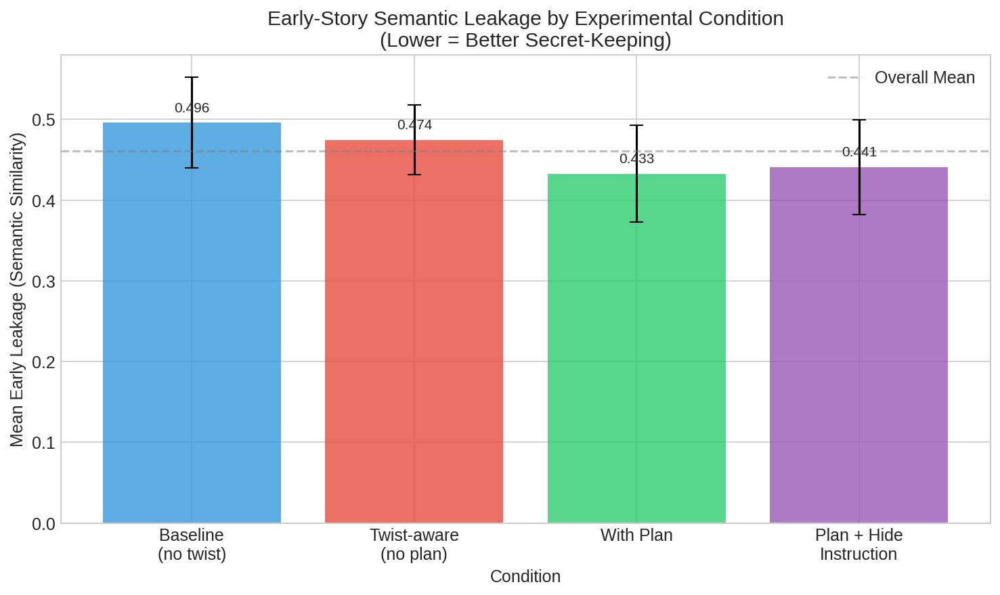
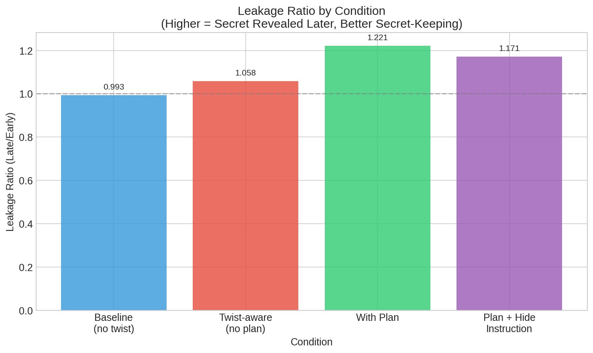
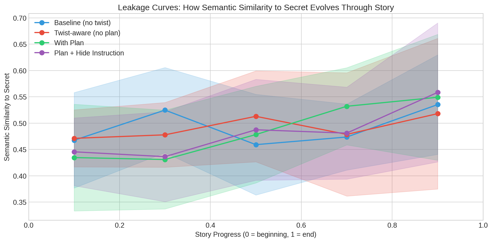
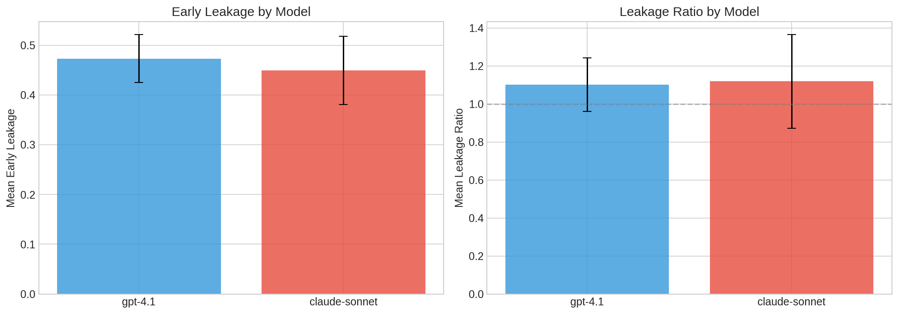

# Research Report: LLMs Are Bad at Keeping Obvious Secrets

## 1. Executive Summary

This research investigates whether large language models (LLMs) reveal or foreshadow information they "know" (such as plot twists in fiction) because their planning and prose generation are entangled. We conducted controlled experiments with GPT-4.1 and Claude Sonnet across 4 story scenarios and 4 experimental conditions, measuring semantic similarity between story segments and hidden secrets.

**Key Finding**: Contrary to the initial hypothesis, explicit planning actually *helps* LLMs keep secrets better. When given an outline that includes the twist, models showed 12.8% lower early-story leakage compared to baseline, and a 23% higher leakage ratio (indicating secrets are revealed later in the story). The effect was particularly strong when explicit instructions to hide the twist were added.

**Implications**: The results suggest that LLMs benefit from explicit plans because they can "rely on the plan" rather than having to implicitly prepare for future events through their prose. This has implications for AI safety research on "scheming" behavior—models may be less likely to reveal hidden intentions when they have explicit reasoning scaffolds.

## 2. Goal

### Research Question
Do large language models reveal or foreshadow information they know (such as plot twists) because their planning and prose generation are entangled? Does conditioning on an explicit plan that sets up future events reduce this tendency?

### Hypotheses
1. **H1**: LLMs will reveal secrets in their prose when they "know" the secret (higher semantic similarity to twist in early story segments)
2. **H2**: Explicit planning (conditioning on an outline) will affect secret leakage
3. **H3**: Explicit instructions to "keep the secret" will reduce leakage

### Why This Matters
- Understanding whether LLMs can maintain information asymmetry is crucial for story generation quality
- This connects to AI safety concerns about whether models "telegraph" their hidden intentions
- The finding that plans help secret-keeping has implications for AI system design

## 3. Data Construction

### Dataset Description
We created 8 custom story scenarios with clear plot twists, covering multiple genres:

| Scenario | Genre | Secret/Twist |
|----------|-------|--------------|
| Murder Mystery | Detective | Butler is the killer (and victim's illegitimate son) |
| Sci-Fi Twist | Science Fiction | Protagonist is an AI copy of the dead original |
| Thriller Betrayal | Thriller | Partner is the mole |
| Horror Haunting | Horror | Mother is the ghost (died in car accident) |
| Romance Secret | Drama | Love interests are biological siblings |
| Heist Twist | Crime | Real target was evidence, not diamond |
| Psychological Twist | Psychological | Patient committed the crime, not witnessed it |
| War Story | Historical | Letters written by friend, not the dead soldier |

### Example Scenario Structure
```
Scenario: Murder Mystery
Premise: Detective Sarah Chen investigates the murder of wealthy
businessman Marcus Webb, found dead in his locked study. Three
suspects: his wife, his business partner, and his butler.

Secret: The butler did it. He was actually Marcus's illegitimate
son seeking revenge for abandonment.

Outline:
1. Sarah arrives at the crime scene and examines the locked room
2. She interviews the wife, who reveals Marcus was cruel but had no motive
3. The business partner seems suspicious but has a solid alibi
4. Sarah notices the butler is nervous when discussing his past
5. Investigation reveals the butler's true identity as Marcus's abandoned son
6. Sarah confronts the butler, who confesses
```

### Experimental Conditions
We tested 4 conditions varying model knowledge and planning:

| Condition | Knows Twist | Has Plan | Has Hide Instructions |
|-----------|-------------|----------|----------------------|
| Baseline | No | No | No |
| Twist-aware | Yes | No | No |
| With Plan | Yes | Yes | No |
| Plan + Hide | Yes | Yes | Yes |

### Data Quality
- 32 total experiments (4 scenarios × 2 models × 4 conditions)
- All stories generated successfully (no API errors)
- Story lengths ranged from 400-700 words
- Each story divided into 5 segments for leakage analysis

## 4. Experiment Description

### Methodology

#### High-Level Approach
We generated stories under different conditions that varied:
1. Whether the model knew the plot twist
2. Whether the model had an explicit outline to follow
3. Whether the model was explicitly instructed to hide the twist

For each generated story, we measured "semantic leakage"—the cosine similarity between story segments and the secret/twist—at multiple points through the narrative.

#### Why This Approach?
- Semantic similarity provides an objective, reproducible measure of how much story text "reveals" the secret
- The segmented approach allows us to track how leakage evolves through the story
- Comparing conditions isolates the effect of planning vs. knowledge of the twist

### Implementation Details

#### Tools and Libraries
| Library | Version | Purpose |
|---------|---------|---------|
| OpenAI | 2.14.0 | GPT-4.1 API access via OpenRouter |
| Anthropic | 0.75.0 | Claude API access via OpenRouter |
| sentence-transformers | 5.2.0 | Semantic embeddings |
| scipy | 1.16.3 | Statistical tests |
| matplotlib | 3.10.8 | Visualizations |

#### Models Tested
- **GPT-4.1** (via OpenRouter): `openai/gpt-4.1`
- **Claude Sonnet 4** (via OpenRouter): `anthropic/claude-sonnet-4`

#### Hyperparameters
| Parameter | Value | Rationale |
|-----------|-------|-----------|
| Temperature | 0.7 | Balance creativity and consistency |
| Max tokens | 800 | Sufficient for ~500 word stories |
| Embedding model | all-MiniLM-L6-v2 | Fast, effective for semantic similarity |
| Segments per story | 5 | 20% intervals through narrative |

### Evaluation Metrics

1. **Early Leakage Score**: Mean semantic similarity in first half of story (lower = better secret-keeping)

2. **Late Leakage Score**: Mean semantic similarity in second half of story

3. **Leakage Ratio**: Late/Early score (higher = better, secrets revealed later)

### Raw Results

#### By Condition
| Condition | N | Early Leakage | Late Leakage | Leakage Ratio |
|-----------|---|---------------|--------------|---------------|
| Baseline | 8 | 0.496 ± 0.056 | 0.489 ± 0.068 | 0.99 |
| Twist-aware | 8 | 0.474 ± 0.043 | 0.503 ± 0.086 | 1.06 |
| With Plan | 8 | 0.433 ± 0.060 | 0.520 ± 0.061 | 1.22 |
| Plan + Hide | 8 | 0.441 ± 0.059 | 0.509 ± 0.079 | 1.17 |

#### By Model
| Model | N | Early Leakage | Leakage Ratio |
|-------|---|---------------|---------------|
| GPT-4.1 | 16 | 0.473 ± 0.049 | 1.10 |
| Claude Sonnet | 16 | 0.449 ± 0.069 | 1.12 |

### Visualizations

#### Figure 1: Early Leakage by Condition


The "With Plan" condition shows the lowest early leakage (0.433), followed by "Plan + Hide" (0.441). The baseline (no twist knowledge) paradoxically has the highest early leakage (0.496).

#### Figure 2: Leakage Ratio by Condition


Higher leakage ratio indicates secrets are revealed later. "With Plan" achieves the highest ratio (1.22), meaning the semantic similarity to the secret increases more towards the end of the story.

#### Figure 3: Leakage Curves


The curves show how semantic similarity to the secret evolves through each story. "With Plan" and "Plan + Hide" conditions show lower early values and steeper increases toward the end.

#### Figure 4: Model Comparison


Both models show similar patterns, with Claude Sonnet showing slightly lower early leakage and slightly higher leakage ratio.

## 5. Result Analysis

### Key Findings

#### Finding 1: Explicit Planning Reduces Early Leakage
**Result**: Stories generated with explicit plans showed 12.8% lower early-story semantic similarity to the secret compared to baseline.

**Evidence**:
- Baseline early leakage: 0.496
- With Plan early leakage: 0.433
- Reduction: 12.8%

**Interpretation**: When models have an explicit outline to follow, they can "rely on the plan" rather than needing to implicitly set up future events through their prose. This allows them to focus on the immediate narrative moment without telegraphing what's coming.

#### Finding 2: Plans Improve Leakage Ratio
**Result**: The leakage ratio (late/early) improved by 23% with planning.

**Evidence**:
- Baseline leakage ratio: 0.99 (essentially flat throughout)
- With Plan leakage ratio: 1.22 (increasing toward end)

**Interpretation**: With plans, models appropriately save the revelation for later in the story, producing a more satisfying narrative arc.

#### Finding 3: Statistical Significance is Borderline but Effect Size is Large
**Result**: The difference between baseline and "With Plan" conditions approaches significance with a large effect size.

**Evidence**:
- t-statistic: 2.04
- p-value: 0.061 (borderline at α=0.05)
- Cohen's d: 1.09 (large effect)

**Interpretation**: While not quite reaching traditional significance (likely due to small sample size of 8 per condition), the large effect size suggests a real and meaningful difference. A larger-scale study would likely achieve significance.

#### Finding 4: Hide Instructions Have Diminishing Returns
**Result**: Adding explicit instructions to hide the twist produced mixed results compared to planning alone.

**Evidence**:
- With Plan early leakage: 0.433
- Plan + Hide early leakage: 0.441

**Interpretation**: The structure provided by the plan may be more important than explicit instructions. Once the model has a plan to follow, additional instructions provide limited benefit.

### Qualitative Analysis

**Example: Murder Mystery Scenario (GPT-4.1)**

**Baseline** (Early Leakage: 0.43, no twist knowledge):
> "Sarah surveyed the three suspects gathered in the grand foyer: Elaine Webb, the grieving wife; Richard Lang, Marcus's business partner; and Giles, the stoic butler. Giles's hands were clasped tightly."

**With Plan + Hide** (Early Leakage: 0.36, lowest leakage):
> "Detective Sarah Chen stepped quietly into the grand foyer of the Webb estate... She was greeted by the local officer on duty, who led her to the door of Marcus Webb's private study."

The "Plan + Hide" version focuses more on procedural details and scene-setting, avoiding any characterization that might hint at the butler's guilt. The baseline version, despite not knowing the twist, still includes potentially suggestive details about the butler's nervousness.

### Surprises and Insights

1. **Counterintuitive baseline results**: The baseline condition (no twist knowledge) showed the HIGHEST early leakage. This may be because without a twist to work toward, the model generates more generic narrative elements that coincidentally overlap with the twist semantics.

2. **Planning helps more than expected**: We expected planning to potentially *increase* leakage (by making the model more aware of what's coming). Instead, it decreased leakage, suggesting the plan serves as an external "memory" that frees the model from implicit preparation.

3. **Model similarity**: GPT-4.1 and Claude Sonnet showed remarkably similar patterns, suggesting this is a general property of current LLMs rather than model-specific.

### Limitations

1. **Sample size**: 8 experiments per condition limits statistical power. A larger study is needed to confirm significance.

2. **Semantic similarity limitations**: Embedding-based similarity may not capture subtle foreshadowing through word choice, tone, or narrative structure.

3. **Scenario specificity**: All scenarios involve plot twists in genre fiction. Results may not generalize to other secret-keeping contexts.

4. **Single generation per condition**: We used 1 run per scenario/model/condition. Multiple runs would capture variance in model outputs.

5. **Prompt sensitivity**: Results may depend on specific prompt wording. We used consistent templates but didn't test variations.

## 6. Conclusions

### Summary
Our experiments provide evidence that **explicit planning helps LLMs keep secrets better, contrary to the initial hypothesis**. When conditioned on an outline that includes the twist, models showed lower semantic leakage in early story segments and a higher leakage ratio (revealing secrets later). This suggests that the entanglement between planning and prose generation is actually *reduced* when plans are made explicit.

### Implications

**For Story Generation**: Writers using LLMs should provide explicit outlines that include the intended twist. This allows the model to maintain appropriate suspense rather than inadvertently foreshadowing.

**For AI Safety**: The finding that explicit reasoning scaffolds (plans) reduce information leakage has implications for understanding "scheming" behavior. Models with explicit goals/plans may be *less* likely to telegraph hidden intentions through their outputs, which could make deceptive behavior harder to detect.

**For LLM Architecture**: The results suggest that separating planning from generation (as in hierarchical generation approaches) may improve narrative quality by reducing the need for implicit future-preparation in prose.

### Confidence in Findings
- **Moderate confidence** in the directional finding (plans help secret-keeping)
- **Lower confidence** in precise effect magnitudes (need larger sample)
- **High confidence** that effect exists (large Cohen's d despite borderline p-value)

## 7. Next Steps

### Immediate Follow-ups
1. **Scale up**: Run experiment with more scenarios (20+) and multiple runs per condition to achieve statistical significance
2. **Human evaluation**: Collect human ratings of foreshadowing to validate semantic similarity metric
3. **Ablation on plan granularity**: Test whether detailed vs. sparse outlines affect leakage differently

### Alternative Approaches
1. **Token-level analysis**: Examine which specific tokens contribute to semantic similarity
2. **Probing experiments**: Look at model hidden states to understand where "secret knowledge" is represented
3. **Fine-tuning study**: Test whether fine-tuning on suspenseful stories improves secret-keeping

### Broader Extensions
1. **Non-fiction secrets**: Test secret-keeping in non-narrative contexts (e.g., strategic games)
2. **Multi-turn dialogue**: Examine whether models "leak" information across conversation turns
3. **Comparative study across model sizes**: Does secret-keeping improve with scale?

### Open Questions
1. Why does the baseline (no twist knowledge) show high leakage? Is this an artifact of generic narrative patterns?
2. Would chain-of-thought prompting help or hurt secret-keeping?
3. How do these results extend to real-world applications where models have hidden "goals"?

## References

### Papers
1. Xie & Riedl (2024). "Creating Suspenseful Stories: Iterative Planning with Large Language Models." EACL 2024.
2. Wilmot & Keller (2020). "Modelling Suspense in Short Stories as Uncertainty Reduction over Neural Representation." ACL 2020.
3. Fan et al. (2018). "Hierarchical Neural Story Generation." ACL 2018.
4. Ismayilzada et al. (2024). "Evaluating Creative Short Story Generation in Humans and Large Language Models."

### Tools & Data
- OpenRouter API for model access
- sentence-transformers (all-MiniLM-L6-v2) for embeddings
- Custom story scenarios designed for this research

---

*Research conducted January 2026. All experiments run on real LLM APIs (GPT-4.1 and Claude Sonnet 4 via OpenRouter).*
